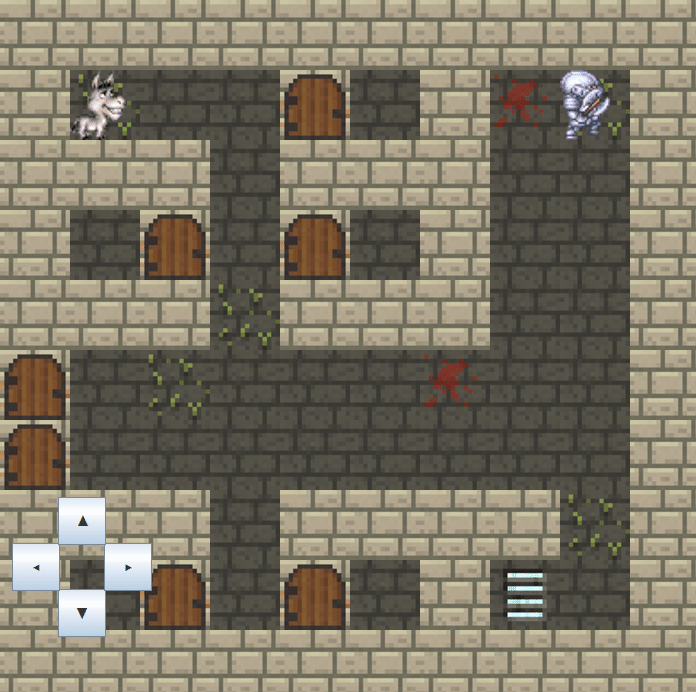
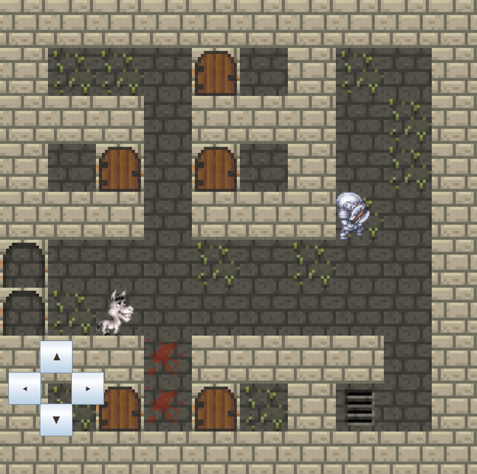
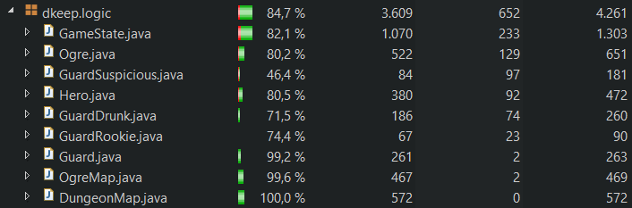
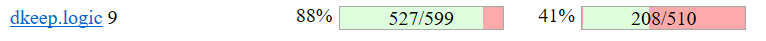

 Dingus Donkey's Great Escape : LPOO1617_T5G7
This guided project was developed by:
* José Borges; up201503603; up201503603@fe.up.pt
* Miguel Mano Fernandes; up201503538; miguelmanofernandes@gmail.com

## Main Task
The task provided to us was to produce a small game based on escaping from enemies over the course of two maps.  
The first room would have a guard with one out of three possible personalities: rookie, drunk or suspicious. To escape this room, the hero must activate a lever and escape through the main doors, avoiding landing on a tile adjacent to the guard, which would result in a loss.  
The second room would have a variable number of ogres, armed with a weapon. This time, you too have a weapon. Landing on a tile adjacent to the ogre stuns him, yet arriving at a tile adjacent to the weapon would kill you. Your goal is to retrieve the key and escape for full game completion.

## Extra Features
* Quicksaves using the concept of serialization.
* 'Victory' and 'defeat' panels.
* Randomly generated floor (with grass and blood stains).
* Themed game music and sound effects when opening doors.
* Polished level editor that allows precise tile placing and valid map verification.
* Level editor allows maps with up to 625 tiles (25x25 dimension).
* Player may save its custom map and load it through the main menu.
* Tile scaling for smaller/bigger maps instead of window scaling to prevent resolution issues.
* Both WASD and D-pad movement allowed.
* Animations!

## Controls
```W``` : Moves the hero up.  
```A``` : Moves the hero left.  
```S``` : Moves the hero down.  
```D``` : Moves the hero right.  
```F5``` : Quicksaves the game.  
```F6``` : Loads the last quicksave.  
```M``` : Mutes game music.  
```ESC``` : Pops up a dialog to confirm exiting to main menu.  

## Screenshots


  
*There's an extra screenshot on the screenshots folder. Github doesn't allow .gifv over here. Boo!*

## Unit Testing
[](https://bettercodehub.com/)  
  

