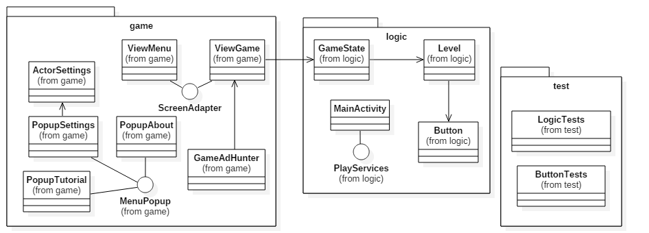

# Ad Hunter

## Setup/Instalação
Esta app comporta-se como uma aplicação normal, não necessitando de um conjunto de passos complexos para o seu correto funcionamento.  
É possível testar a app através da transferência e **instalação do .apk** no dispositivo Android (localizado em /adhunter/adhunter-app.apk pretendido ou através da abertura do **projeto de Android Studio**, sua compilação e sucessiva execução, recorrendo a um emulador.  
Caso requisitado, será possível publicar a aplicação da Play Store, facilitando assim o processo.  
Visto Ad Hunter aceder a Google Play Services e funções de vibração e acelerómetro, poderá resultar em comportamentos inesperados após a execução em desktop, pelo que é fortemente desaconselhada optar por esta plataforma.

## Diagrama UML

## Design Patterns
Ao longo do desenvolvimento da aplicação, os seguintes design patterns foram utilizados:
* **Singleton** - é criada uma instância com um ponto de acesso global para facilitar a leitura da lógica do jogo pela parte gráfica, sem propriamente uma instanciação privada.
* **Builder** - os pop-ups são compostos por um background e um foreground, cada um tendo instanciações diferentes, pelo que se implementou uma interface MenuPopup e múltiplas subclasses para cada um dos botões que implementam, da sua forma, estes conceitos.

Referência ainda ao **Decorator** que, momentaneamente, foi implementado, porém descartado, visto não resultar numa maior facilidade de manutenção do projeto, dado às limitações do libGDX.

## Dificuldades
De longe, a principal dificuldade terá sido a aprendizagem do libGDX e correta integração com o Android Studio. O que outrora seria relativamente simples de implementar (como os serviços da Google Play e JUnit), tornou-se exclusivamente complicado por causa de métodos adicionais de compatibilidade requerida pelo libGDX. Múltiplas horas terão sido gastas exclusivamente na implementação destas funcionalidades.

## Lições aprendidas
Com um projeto interessante como o desenvolvimento de uma aplicação Android é fácil priorizar certos detalhes que poderão não ser os mais relevantes. Pensamos que, além de aprofundar as aptidões de Java e aprender a nova biblioteca do libGDX, uma divisão eficiente do projeto revelou-se um aspeto importante que aperfeiçoámos.

## Tempo dispendido
Este projeto envolveu um trabalho contínuo de aproximadamente **80 horas**. Obviamente que é complicado realizar uma aproximação tendo em conta períodos de pausa para outras cadeiras e noites intensivas no projeto.

## Distribuição de trabalho
O trabalho foi distribuído igualmente pelos dois elementos, sendo que o projeto final é, ele também, produto do esforço igual de ambos.

## Manual de instruções
A interface da aplicação é bastante auto-explicativa.  
No **menu principal**, o ícone da roda dentada acede às definições, o ícone do utilizador acede a uma descrição rápida sobre o software e o ícone com uma interrogação explica os conceitos básicos do jogo.  
Além disso, no canto inferior esquerdo, a medalha abre o menu das proezas e a coroa acede aos leaderboards, incorporando os serviços do Google Play Games.  

  
No **ecrã pré-jogo** é introduzido ao utilizador os botões a clicar/evitar, informação que deve ser decorada no tempo apresentado.  

No **ecrã de jogo** são apresentados os níveis e stages, assim como o tempo restante para completar cada nível.  

